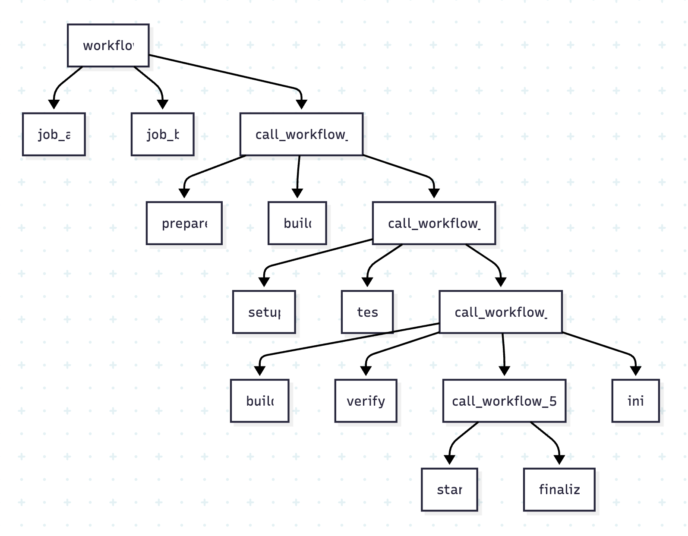

# wk2mmd

[](https://github.com/leocomelli/wk2mmd/actions/workflows/ci.yml)
[](https://goreportcard.com/report/github.com/leocomelli/wk2mmd)
[](LICENSE)

> **wk2mmd**: Generate Mermaid diagrams from GitHub Actions workflows.

## Overview

`wk2mmd` is a CLI tool that analyzes GitHub Actions workflow files and generates [Mermaid](https://mermaid-js.github.io/) diagrams (flowchart and sequence) representing the workflow structure, jobs, and dependencies. It supports both local and remote workflows, including reusable workflows.

## Screenshot

Example of a generated Mermaid flowchart from a GitHub Actions workflow:



## Features
- Parse and visualize complex GitHub Actions workflows
- Support for reusable workflows
- Generates Mermaid flowchart and sequence diagrams
- Handles jobs with the same name in different contexts
- CLI with configurable log level
- Easy integration with CI/CD pipelines

## Installation

### Using Go
```sh
go install github.com/leocomelli/wk2mmd@latest
```

### From Release
Download the latest binary from the [releases page](https://github.com/leocomelli/wk2mmd/releases) and add it to your PATH.

## Usage

```sh
wk2mmd --help
```

### Example: Generate a flowchart from a workflow file
```sh
wk2mmd -t flowchart -d 2 -k <github_token> .github/workflows/ci.yml
```

### Example: Generate a sequence diagram
```sh
wk2mmd -t sequence .github/workflows/ci.yml
```

#### Options
- `-t, --diagram-type`: Diagram type (`flowchart` or `sequence`)
- `-d, --depth`: Maximum depth for recursive analysis
- `-k, --token`: GitHub token for private repositories
- `--log-level`: Log level (`debug`, `info`, `warn`, `error`)

## Running Tests

```sh
make test           # Run unit tests
```

## Contributing

Contributions are welcome! Please open issues and pull requests. For major changes, open an issue first to discuss what you would like to change.

1. Fork the repository
2. Create your feature branch (`git checkout -b feature/my-feature`)
3. Commit your changes (`git commit -am 'feat: add new feature'`)
4. Push to the branch (`git push origin feature/my-feature`)
5. Open a pull request

Please follow the [Conventional Commits](https://www.conventionalcommits.org/) specification for commit messages.

## License

This project is licensed under the MIT License - see the [LICENSE](LICENSE) file for details.

---

> wk2mmd is not affiliated with GitHub. "GitHub" and "GitHub Actions" are trademarks of GitHub, Inc.